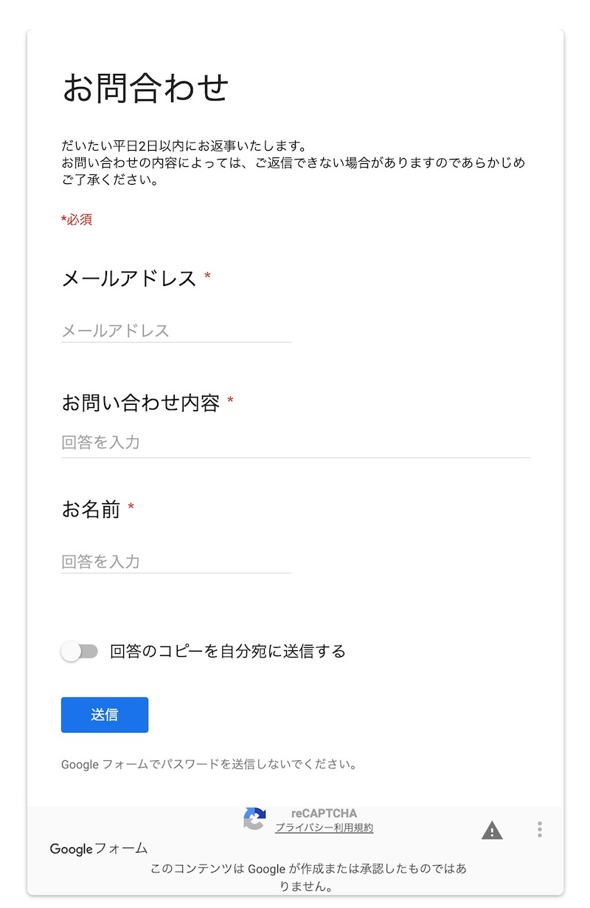
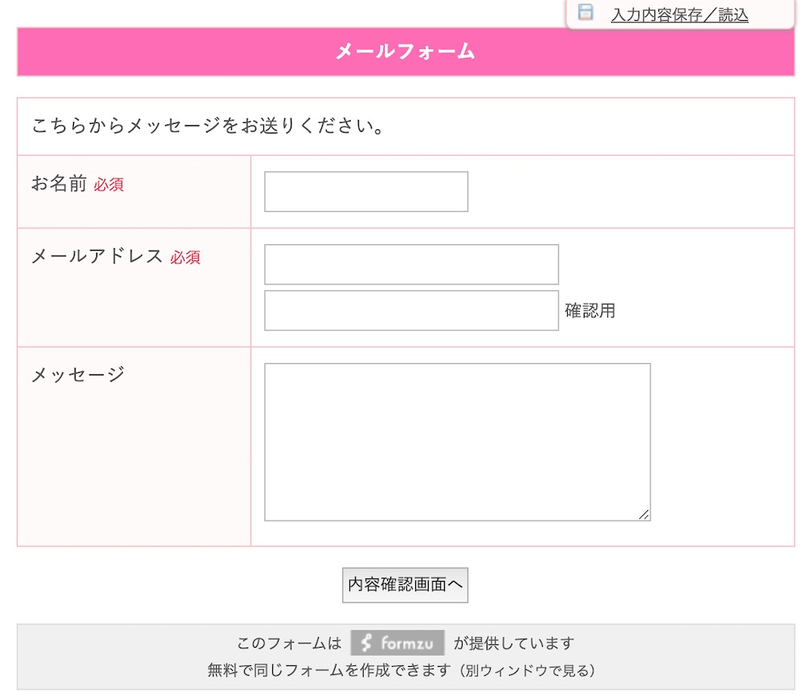

この記事では、「Wordpressでは、お問い合わせフォームってどれを使ったらいいの?」という疑問について、解説します。

## Wordpress向けお問い合わせフォームの設置方法

Wordpressで、お問い合わせフォームを設置するには2つのやり方があります。

**①無料サービスを利用する**

外部のメールフォーム作成ツールでお問い合わせフォームを作成し、自分のサイトに設置するやり方です。 簡単な操作でお問い合わせフォームを作れるので初心者の方にオススメです。

**②Wordpressプラグインを利用する**

WordPress内にフォーム作成機能を追加します。 HTMLの知識があれば、自由にカスタマイズできます。 デザインをサイトと統一したい、同じサイトの中でフォームを管理したい場合はプラグインを使うのがオススメです。

## 無料フォーム作成サービスを使って、フォームを設置する

アンケートやお問い合わせに使える、フォームの作成・管理、入力内容のチェック、自動返信メールなどの機能を提供しているサービスを紹介します。

フォーム作成後Wordpress のページ本文内にフォーム埋め込みコード入力して公開すれば、お問い合わせフォームを設置できます。 プラグインを使うよりも、てっとり早く設置できます。

とくにGoogleフォームとFormzuがおすすめです。

### Googlフォーム

[Googleフォーム](https://www.google.com/intl/ja_jp/forms/about/)は、Googleアカウントがあれば誰でも利用できる、アンケートフォーム作成ツールです。

＜特徴＞

* 質問と選択肢を用意するだけで簡単にできる
* パソコンでもスマホでも利用できる
* 回答を自動集計しできる

＜デメリット＞
* デザインが決まっている
* 住所の自動入力ができない

こんなお問い合わせフォームが作れます。

### Formzu

[Formzu](https://ws.formzu.net)も手軽にフォームを作成できるツールです。GoogleFormsよりも、質問項目がきめ細やかに設定できます。

＜特徴＞
* 使える質問項目が豊富
* 条件分岐がでできる
* 質問項目を区切ったり、まとめたりできる
* お問い合わせ内容を100件まで無料で保存

＜デメリット＞
* 無料では追加できる質問項目に制限がある(12個まで)
* 容量の大きい(2MBを超える)ファイルを添付できない
こんなお問い合わせフォームが作れます。

## Wordpressプラグインを使って、フォームを設置する

Wordpressで提供しているお問い合わせ用のプラグインを紹介します。

プラグインをインストールすると、メニューの中にお問い合わせという項目が追加され、お問い合わせフォームを作成できます。フォームを作成した後、表示させたいページの本文の中にショートコードを貼り付けます。 HTMLやCSSに抵抗がない方は、サイトに合わせて柔軟にカスタマイズできます。

### Contact Form7

[Contact Form7](https://ja.wordpress.org/plugins/contact-form-7/)はワードプレスのお問い合わせフォームの中で最も有名なプラグインです。 簡単にフォーム作成・設置ができます。

＜機能＞
* お問い合わせフォームの作成
* 必須項目、入力内容のチェック
* 自動返信メール

＜デメリット＞
* 入力内容の確認画面がない
* お問い合わせ内容の保存・管理ができない

### MW WP FORM
[MW WP FORM](https://ja.wordpress.org/plugins/mw-wp-form/)もContact Form7と同様に、簡単にお問い合わせフォームを作成・設置できるプラグインになっています。

＜機能＞
* お問い合わせフォームの作成
* 必須項目、入力内容のチェック
* 自動返信メール
* 確認画面を設置できる
* お問い合わせ内容をデータベースに保存ができる
MW WP FORMは、確認画面を設置できること、問い合わせ内容をデータベースに保存ができることが、Contact Form7との違いです。

＜デメリット＞
* 自動返信メールの設定欄が小さい

## 問い合わせフォームのまとめ

簡単にお問合せフォームを設置したい
 →無料サービスを利用する：Googleフォーム、Formzu

HTML/CSSに詳しく自分でカスタマイズしたい
 →WordPressプラグインを使う：Contact Form7、MW WP FORM

お問合せフォームを選ぶ参考にしてみてください。
