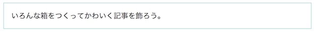
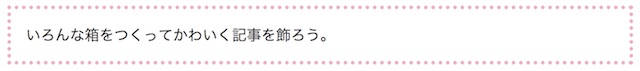
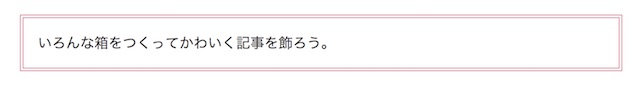
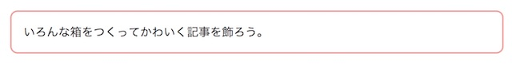
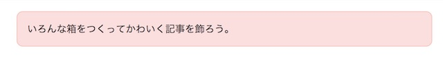
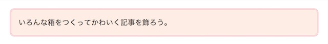
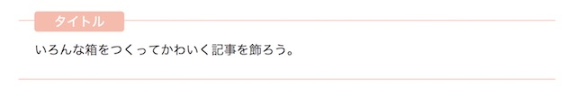

見出しデザインに続いて、CSSのコピペだけで反映できる、飾り枠のデザインを用意しました。 フォントのサイズや色はご自由に変更ください。
## 基本の飾り枠

この記事で紹介するデザインでは、HTMLを以下のように記述しています。 `<div>~</div>`の中の文章を好きに書き換えて使ってくださいね。

```markup:title=HTML
<div class="border-box">
    いろんな箱をつくってかわいく記事を飾ろう。
</div>
```

### シンプルな枠線

一番シンプルな飾り枠はこれですね。



```css:title=CSS
.border-box{
    border:1px solid #97D3D3;
    padding:16px;
    margin:20px;
}
```

border: 線の太さ 線の種類 線の色という形で設定します。
paddingは枠の中の余白。
marginは枠の外の余白を設定します。

線を太くすることもできます。


```css:title=CSS
.border-box{
    border:5px solid #97D3D3;
    padding:16px;
    margin:20px;
}
```

点線にすると、さりげなく。


```css:title=CSS
.border-box{
    border:3px dashed #97D3D3;
    padding:16px;
    margin:20px;
}
```


### ドットな枠線

ドットにすると、可愛らしさがUP🌸



```css:title=CSS
.border-box{
    border:4px dotted #EEB1C0;
    padding:16px;
    margin:20px;
}
```

### 二重線な枠線

二重線にするときはborderの太さを3pxより大きくした方がきれいです。



```css:title=CSS
.border-box{
    border:4px double #DA8596;
    padding:16px;
    margin:20px;
}
```

### 角を丸くする

border-radiusで角を丸くします。10pxくらいが使いやすくておすすめです✨



```css:title=CSS
.border-box{
    border:2px solid #F2A09B;
    border-radius:10px;
    padding:16px;
    margin:20px;
}
```

### 背景色をいれる



枠線は細めで、背景色よりもちょっとだけ濃くするのが可愛いかなと思います☺️

```css:title=CSS
.border-box{
    border:1px solid #F6BCAC;
    background-color:#FBDFDF;
    border-radius:10px;
    padding:16px;
    margin:20px;
}
```
background-color:枠内の背景色になっています。

枠を二重線にするのもすてき。



```css:title=CSS
.border-box{
    border:3px double #F6BECA;
    background-color:#FDEDE3;
    border-radius:10px;
    padding:16px;
    margin:20px;
}

```

## アレンジ編

### 影をつける


```css:title=CSS
.border-box{
border:1px solid #C1E2E4;
box-shadow: 4px 4px 1px #82C5CA;
padding:16px;
margin:20px;
}
```

### 箱の中に枠線をつくる


```css:title=CSS
.border-box{
    border:4px solid #FFFFFF;
    background-color: #F8C8B2;
    box-shadow:0 0 0 8px #F8C8B2;
    padding:16px;
    margin:20px;
}
```

### サブタイトルをつけてみる



```markup:title=HTML
<div class="border-box">
    <span class="title">ポイント</span>
    いろんな箱をつくってかわいく記事を飾ろう。
</div>
```

```css:title=CSS
.border-box{
    position:relative;
    border-top:1px solid #F6BCAC;
    border-bottom:1px solid #F6BCAC;
    background-color: #F8DDC8;
    padding:25px 20px;
    margin:30px;
}
.border-box .title{
    position:absolute;
    top: -12px;
    left: 10px;
    padding: 5px 25px;
    background-color: #F6BCAC;
    border-radius:4px;
    color:#fff;
    line-height: 1em;
}
```
