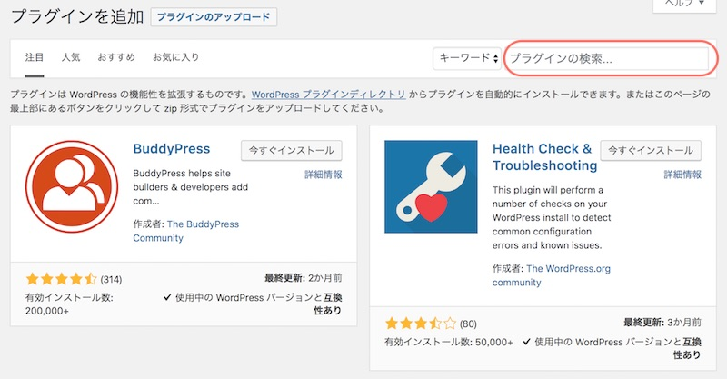
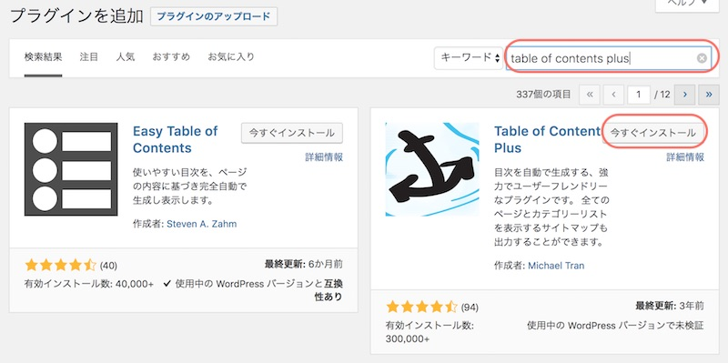
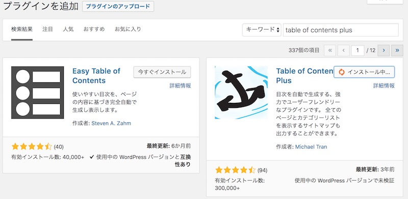
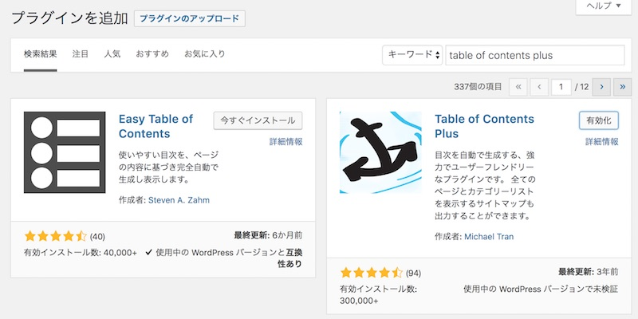
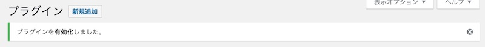
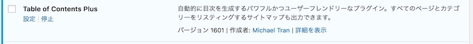

プラグインはWordPressにインストールできる追加機能です。

私がWordPressに入れているプラグインを一覧化しました。
私自身あのプラグインなんだっけ〜っと忘れるので備忘録です

## よく使うプラグイン

[Akismet](https://wordpress.org/plugins/akismet/)

コメントやお問い合わせフォームを開いている場合、スパムが送られないように防いでくれる。

[Google XML Sitemaps](https://ja.wordpress.org/plugins/google-sitemap-generator/)

Googleにサイトマップ（サイトの構成図）をお知らせしてくれる。

[Broken Link Checker](https://ja.wordpress.org/plugins/broken-link-checker/)

ページのリンクが切れてしまっているときに、お知らせしてくれる。

[Category Order and Taxonomy Terms Order](https://ja.wordpress.org/plugins/taxonomy-terms-order/)

カテゴリーの順番を自分で入れ替えられるようになる。

[WordPress Ping Optimizer](https://wordpress.org/plugins/wordpress-ping-optimizer/)

記事が更新された時に、検索エンジンに素早く載せてくれるようGoogleさんたちにお知らせしてくれる。

[WP Multibyte Patch](https://ja.wordpress.org/plugins/wp-multibyte-patch/)

日本語の文字列を正しく認識してくれる。

[EWWW Image Ootimizer](https://ja.wordpress.org/plugins/ewww-image-optimizer/)

画像のサイズを圧縮して、軽くしてくれる。

[WP-Optimize](https://ja.wordpress.org/plugins/wp-optimize/)

ブログ記事書いたり更新していると、地味に更新履歴が溜まっていきます。データベースに余計なデータが溜まってしまうので、それをキレイキレイしてくれる。

[Table of Contents Plus](https://ja.wordpress.org/plugins/table-of-contents-plus/)

ブログの記事に目次を自動で入れてくれる。

[MW WP Form](https://ja.wordpress.org/plugins/mw-wp-form/)

こちらもお問い合わせフォーム用。確認画面、送信画面の設定がついており、Contact Form7よりもカスタマイズの幅が広いと思う。

[WP Mail SMTP](https://ja.wordpress.org/plugins/wp-mail-smtp/)

環境によっては、お問い合わせフォームからの自動返信メールが正しく送られなかったりします。このプラグインを使ってメール設定する。

### セキュリティ

**[Wordfence Security](https://ja.wordpress.org/plugins/wordfence/)**

[SiteGuard WP Plugin](https://ja.wordpress.org/plugins/siteguard/)

管理ページのログインを強化してくれる。

### 広告リンク

[Rinker](https://oyakosodate.com/rinker/)

### 記事の管理

[WP All Export](https://ja.wordpress.org/plugins/wp-all-export/)

記事の一覧をEXCELでエクスポートできる。

## プラグインのインストール方法

プラグイン＞新規追加

検索バーから追加したいプラグインを検索します。

「今すぐインストール」をクリックします

インストールが終わると、ボタンが有効化に変わります。

「有効化」ボタンをクリックします。

【プラグイン一覧】 一覧画面に戻り、プラグインを有効化しましたというメッセージが表示されます。

有効化されたプラグインは青で表示されます。

稀にテーマとの相性が合ないと、正しく動かない（画面が真っ白になってしまう）ことがあります。これはプラグインを無効にすれば元に戻ります。特に画像やキャッシュに関連したプラグインだとそうなりやすいみたい。

プラグインを入れるときは、一つずつ有効化して、動くか確認してください。

プラグインを使うときは、一緒に使うと動かなくなるものもあるので、一つずつ有効化して動くか確認してください。

