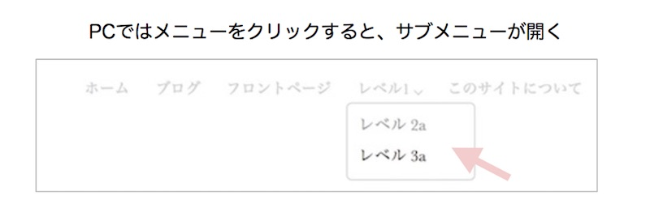
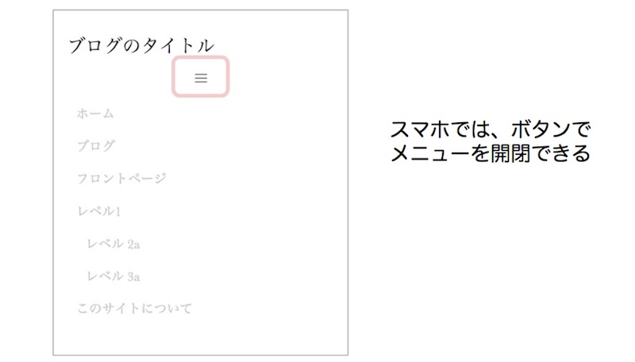
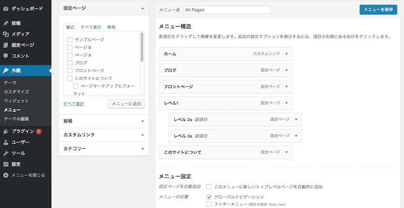
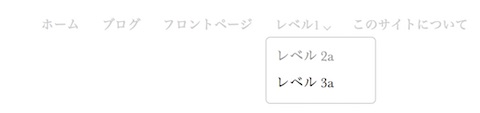

今回は、WordPressのグローバルメニューの設置&カスタマイズの仕方です。 メニューが階層になっていると、メニューにマウスをあてると、子メニューが表示されるようにします。



また、スマホとPCでメニューの表示を切り替えて、スマホの時はボタンでメニューを開閉できるようにします。



## functions.phpからカスタムメニューを追加する

メニューを使うには、functions.phpに以下のコードを追記して、カスタムメニューの機能を追加します。

```php:title=functions.php
//functions.php
register_nav_menus(
    array(
        'global' => 'グローバルナビゲーション',
    )
);
```

「global」というのがテーマ内で使う名前で、「グローバルナビゲーション」が管理画面で表示される名前です。
arrayの中に`'global' => 'グローバルナビゲーション',`のセットを追記すると、複数メニューを作れます。

## 管理画面でメニューの設定を行う。

管理画面の外観＞メニューから、メニューの表示設定ができます。



ページを選んで、上で指定したメニュー名「グローバルナビゲーション」のチェックをクリックします。

## header.phpにカスタムメニューを追加する

まずはグローバルメニューを追加したいところに、`wp_nav_menu`のコードを書きます。

```php:title=functions.php
//header.php
<header id="header" role="banner">
    <div class="container-fluid">
        <div class="row">
            <div class="col-md-4">（省略：ロゴを出力）</div>
            <div class="col-md-8">
                <?php if(has_nav_menu('global')): ?>
                    <?php wp_nav_menu( array(
                        'theme_location' => 'global',
                        'container' => 'nav',
                        'container_id' => 'globalnavi'
                    ));
                ?>
                <?php endif; ?>
            </div>
        </div>
    </div>
</header>
```

※bootstrapをCSSフレームワークに使っています。div属性のcontainer-fluid、row、col-md-XXはbootstrapに用意されているレイアウト設定です。

[wp_nav_menu()の指定項目の書き方](/wordpress-theme-functions/)

## メニューのデザインを変更する
### WordPressで出力されるナビゲーションメニューのHTML

```markup
<nav id="globalnavi">
    <ul class="menu">
        <li id="menu-item-XXX" class="menu-item"><a>メニュー項目</a></li>
        <li id="menu-item-XXX" class="menu-item menu-item-has-children"><a>子ページのある項目</a>
            <ul class="sub-menu">
                <li id="menu-item-XXX" class="menu-item"><a>コページ</a></li>
            </ul>
        </li>
    </ul>
</nav>
```

WordPressがHTMLを出力する時に、自動で付加されるクラスがあります。

* リスト（ul）のクラスにはmenuが設定されます
* メニュー項目（li）のクラスには「manu-item」が設定されます。
* さらに階層のあるメニュー項目（li）のクラスには「manu-item-has-children」が設定されます。
* 子階層のリスト（ul）には「sub-menu」が設定されます。

これらのクラスを使って、デザインの設定をしていきます。

## スマホ用のCSSの設定

```css:title=style.css
//style.css
#globalnavi ul {
    list-style: none; /* リストの黒丸をなくす */
    padding: 0;
    margin: 0;
}

#globalnavi ul li.menu-item {
    display: block; /* スマホの時はブロック表示にして縦並び */
    margin: 10px 0px;
}

/* メニューの文字色、余白、サイズの設定、この辺はお好みで。 */
#globalnavi ul li.menu-item a {
    font-size: 14px;
    padding: 30px 10px;
    color: #ccc;
    -webkit-transition: 0.5s;
    -o-transition: 0.5s;
    transition: 0.5s;
}

/* マウスオーバー、クリックした時に色を黒くする */
#globalnavi ul li.menu-item a:hover,
#globalnavi ul li.menu-item a:focus,
#globalnavi ul li.menu-item a:active {
    color: #000;
}

/* 子メニューはインデントさせる */
#globalnavi ul li.menu-item .sub-menu {
margin-left: 10px;
}
```

スマホではいい感じに表示できました。


続いて、PC画面用のCSSを設定します。

PC画面ではメニューを横並びにします。 また、子メニューがある場合は、マウスが乗っかった時に、メニューを表示できるよう設定します。




```css:title=style.css
@media screen and (min-width: 768px) {
    #globalnavi ul {
        text-align: right; /* メニューを右に寄せます */
    }
    #globalnavi ul li.menu-item {
        margin: 0;
        padding: 0;
        display: inline; /* インライン表示にすることで、横に並びます */
    }

    #globalnavi ul li.menu-item-has-children {
        position: relative; /* 子メニュー表示の基準値とする */
    }

/* 子メニュー用の設定 */
    #globalnavi ul li .sub-menu {
        display: none; /* はじめは非表示 */
        width: 120px; /* 子メニューを表示する横幅 */
        z-index: 1; /* 重ね順を上にする */
/* 子メニューの表示位置：親メニューから上部20pあけて表示させる */
        position: absolute;
        top: 20;
        left: 0;
/* 子メニューのデザインはお好みで。今回は角丸のボックスにしています */
        text-align: left;
        background: #fff;
        margin: 0;
        padding: 10px;
        border: 1px solid #CCC;
        -webkit-border-radius: 5px;
        -moz-border-radius: 5px;
        -ms-border-radius: 5px;
        border-radius: 5px;
    }

/* 子メニューの行間を設定 */
    #globalnavi ul li .sub-menu li {
        display: block;
        margin-bottom: 7px;
    }

/* 一番下の子メニューの余白を調整 */
    #globalnavi ul li .sub-menu li:last-child {
        margin-bottom: 0;
    }

/* マウスオーバーした時に、子メニューを表示させる */
    #globalnavi ul li:hover .sub-menu {
        display: block;
    }

/* 子メニューがあるとき、メニューの右に下矢印をつけます。 */
    #globalnavi ul li.menu-item-has-children > a::after {
        content: '';
        display: inline-block;
        width: 6px;
        height: 6px;
        margin: 0 0 0 5px;
        border-right: 1px solid #ccc;
        border-bottom: 1px solid #ccc;
        -webkit-transform: rotate(45deg);
        -ms-transform: rotate(45deg);
        -o-transform: rotate(45deg);
        transform: rotate(45deg);
    }
}
```

### スマホ用のメニューボタンを追加する

スマホ用のメニューを作ります。 ボタンをクリックするとメニューが開いたり閉じたりするやつです。


まずはグローバルメニューの前にボタンを用意します。

```php
<div class="col-md-8">
    <div class="nav-button">
        <button type="button" id="navbtn">
            <i class="icon-menu"></i>
        </button>
    </div>
    <?php if(has_nav_menu('global')): ?>
        <nav id='globalnavi' role="navigation">
            <?php wp_nav_menu( array(
                'theme_location' => 'global',
                'container' => none,
            ));
            ?>
        </nav>
    <?php endif; ?>
</div>
```

※メニューはwebアイコンicomoonを使っています。（本記事ではWebアイコンの導入方法の説明は割愛します。）

### CSSの設定

PCの時はメニューを表示させているので、スマホの時のみメニューボタンを表示させます。

```css:title=style.css
.nav-button{
    text-align:center; /* 中央に表示する */
    @media screen and (min-width: 768px){
        display:none; /* スマホより大きい時は表示しない */
    }
}
```

### jQueryを使ってメニューを開いたり閉じたりする

以下のコードをjsファイルに追記します。

```js:title=main.js
jQuery(function(){
    jQuery('#navbtn').click(function(){
        jQuery('#globalnavi').slideToggle();
    });
});
```

ボタン（#navbtn）をクリックすると、ナビゲーションメニュー#globalnaviを開いたり閉じたりします。

### スマホの初期表示ではメニューを隠す

```css:title=style.css
/* スマホの時は非表示 */
#globalnavi {
    display: none;
}
/* PCの時は表示 */
@media screen and (min-width: 768px) {
    #globalnavi {
    display: block;
}
```

これで完成です。
