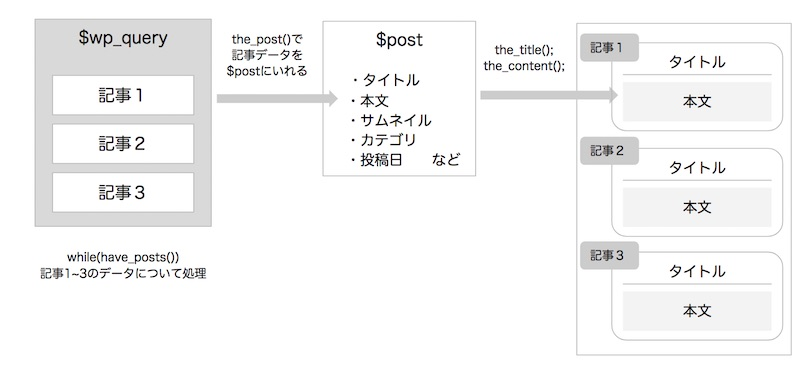
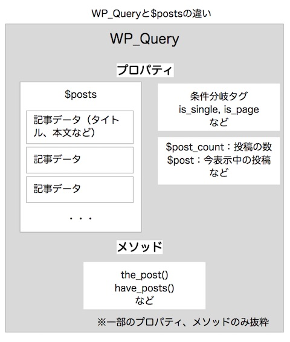

WordPressで記事を表示するときいくつか書き方があります。 「それぞれの書き方はどう違うの？」 「そもそも、このプログラムは何をしているの？」 テンプレートを書いてて、分からなくなってきたので、WordPressの記事を表示する仕組みとコードの意味について整理してみました。 WordPressのサイトにアクセスしてからページが表示されるまで。
--

WordPressがページを表示するときの流れを図解します。


① ユーザーがリンクをクリックすると、表示したいURLをWordPressに伝えます
※この間に、WordPressのコアファイルがプラグインや、functions.phpなどを読み込ますが、詳細は割愛します。
②データベースにアクセスし、表示したいページの記事データを取得します($wp_queryに保存されます)。
③テーマフォルダから、ページに応じたテンプレートファイルを選びます。
④テンプレートファイルと記事データを使って、ページを表示します


ポイントは②WordPress側で記事データは自動で準備してくれるところ。

テーマを作るときは、テンプレートファイルに、この記事データの内容を表示させるプログラムを書いていきます。

## メインコンテンツを表示するメインクエリ

WordPressはアクセスしたURLに必要な記事データを自動でデータベースから取得してくれます。
ページに必要なコンテンツをデータベースに依頼することをメインクエリと呼んでいます。

※クエリ（Query）とはデータベースへのお問い合わせのこと。メインクエリとは、「このページのメインコンテンツを取得してね」とWordPressからデータベースにお願いをしているんだとイメージしてください。

WordPressのテンプレートファイルには、よくこんなコードが書かれていますね。

```php
<?php if(have_posts()): // ①記事データが入って入れば処理を行う
    while(have_posts()): // ②各記事データについて処理を行う
        the_post(); // ③次の記事データの情報を$postに入れる。
        the_title(); // ④$postからtitle(記事タイトル)を表示
        the_content(); // ④$postからcontent(記事本文)を表示
    endwhile;
else : ?>
    <p>記事が見つかりません。</p>
<?php endif; ?>
```

このプログラムはメインクエリによって保存された記事データ($wp_query)から、各記事の情報を取り出して、タイトルや本文を表示させています。



メインクエリをもとに、記事を表示させるループを**メインループ**と呼ばれます。 WordPressのコアファイル側がメインクエリを取得しておいてくれるため、テンプレートファイルにはメインクエリから記事データを表示するところだけ書けば良いわけです。

## さらなる記事データを表示するサブクエリ

WordPressがはじめに取得してくれるメインクエリとは別のデータを使いたいときには、**サブクエリ**を使います。 例えば、関連記事（同じカテゴリーの記事）や同じ著者の他の記事を表示させたいときには、サブクエリの出番です。

* [投稿に関連記事を表示する方法](/wordpress-related-posts/)

2ステップでコードを書きます。

①サブクエリ（ほしい記事データの条件）を指定して、データベースから記事データを取得する

②取得した記事データをページに表示する サブクエリを使って記事を表示させるときにはWP\_Queryを使う方法と、get\_postを使う方法の２種類があります。

### WP\_Queryを使う

グローバル変数$wp\_queryに記事データを格納するやりかたです。

```php
// ①サブクエリを指定して、データベースから記事データを取得する
<?php $args = array( // 抽出条件を指定する
    'post_per_page' => '5',
    'post_type' => 'post',
);
$query = new WP_Query( $args );
//②取得した記事データをページに表示する
if( $query->have_posts() ) :
    while ( $query->have_posts() ) :
        $query->the_post();
        <a href="<?php the_permalink(); ?>"><?php the_title(); ?></a>
    <?php endwhile;
    wp_reset_postdata(); ?>
<?php else : ?>
    <p>記事が見つかりません。</p>
<?php endif; ?>
```

①WP_Query()で使える抽出条件
抽出条件いっぱいあるので、一部だけ抜粋しました。

```php
<?php $args = array(
    'author' => 1,2,3, // 著者ID省く場合は-1,-2,-3
    'category__in' => array( 1, 2 ), // カテゴリーID(複数)
    'post__in' => array( 3,4 ), // 記事ID(複数)
    'order' => 'DESC', // ソート順(ASC,DESC)
    'orderby' => 'date'
); ?>
```


【WP\_Queryで使える抽出条件についての詳しい記事】

* <a href="https://liginc.co.jp/320285" target="_blank" rel="noopener noreferrer">WP\_Queryを使って、記事を自在に取得してくる方法 | 東京上野のWeb制作会社LIG</a>
* <a href="http://notebook.yamamotohiroyuki.com/wordpress/2012/08/15/%E3%81%A1%E3%82%87%E3%81%84%E3%81%A1%E3%82%87%E3%81%84%E5%BF%98%E3%82%8C%E3%82%8B%E3%80%8Ewp_query%E3%80%8F%E3%81%AE%E4%BD%BF%E3%81%84%E6%96%B9/" target="_blank" rel="noopener noreferrer">ちょいちょい忘れる『WP\_Query』の使い方 | 予習と復習</a>
* <a href="http://notnil-creative.com/blog/archives/1288" target="_blank" rel="noopener noreferrer">WP\_Queryの使い方をPHPコードにまとめた便利なコード・スニペット</a>

②取得した記事データをページに表示する

サブクエリを元に記事を表示するループをサブループと呼びます。
メインループと同じようにhave_posts()やthe_post()を使います。

`wp_reset_postdata()`は、サブループで使っていた`$post`をメインループの値に戻してあげる処理です。

`$post`は、メインループとサブループで共有しているので、ここでリセット忘れると、その後のメインループ処理が続けられず、正しく表示できないらしい。

### get\_postsを使う

$posts（記事情報）の配列に記事データをいれるやり方です。

```php
<?p
// ①サブクエリを指定して、データベースから記事データを取得する
<?php $args = array( // 抽出条件を指定する
    'post_per_page' => '5',
    'post_type' => 'post',
);
$myposts = get_posts( $args );
//②取得した記事データをページに表示する
if($myposts)
    foreach($myposts as $post):
        setup_postdata($post); ?>
        <a href="<?php the_permalink(); ?>"><?php the_title(); ?></a>
    <?php endforeach;
    wp_reset_postdata();
else : ?>
    <p>記事が見つかりません。</p>
<?php endif; ?>
```

①get_post()で使える抽出条件

```php
<?php
$args = array(
    'posts_per_page' => 5, // 取得件数（初期値：5）
    'offset' => 0, // 最初に取得する記事（初期値：０）
    'category' => '', // カテゴリーID
    'category_name' => '', // カテゴリー名称
    'orderby' => 'date', // 記事をソートする条件
    'order' => 'DESC', // 記事のソート順（ASC,DESC）
    'include' => '', // 含める記事ID
    'exclude' => '', // 除外する記事ID
    'post_type' => 'post', // 記事タイプ（post,page）
    'author' => '', // 著者のID
    'author_name' => '', // 著者の名前
    'post_status' => 'publish', // 記事のステータス
);
$posts_array = get_posts( $args ); ?>
```

【get\_posts()で使える抽出条件についての詳しい記事】
* <a href="https://elearn.jp/wpman/function/get_posts.html" target="_blank" rel="noopener noreferrer">get\_posts – WordPress私的マニュアル</a>

* <a href="https://memocarilog.info/wordpress/templatetug/3393" target="_blank" rel="noopener noreferrer">get\_posts()テンプレートタグを使った情報の取得と表示方法 ｜ memocarilog</a>

* <a href="http://wpdocs.osdn.jp/%E3%83%86%E3%83%B3%E3%83%97%E3%83%AC%E3%83%BC%E3%83%88%E3%82%BF%E3%82%B0/get_posts" target="_blank" rel="noopener noreferrer">テンプレートタグ/get posts - WordPress Codex 日本語版</a>

②取得した記事データをページに表示する

`setup_postdata($post)`で記事データの配列から、`$post`に記事データを入れます。また、記事内容を表示するテンプレートタグ`the_title()`や`the_content()`が使えるようになります。

### WP\_Queryとpostの違い

WP\_Queryとpostでは記事データを入れる変数（データを入れる箱）が違います。



単なる記事の情報だけ使うときはget\_post() 、記事の情報＋ページの条件分岐タグを使うときはWP\_Queryと覚えておくといいと思います。

## まとめ
* URLに応じて、WordPressでは必要なページの記事データを自動取得してくれる
* メインクエリは、そのURLのメインコンテンツを表示するときに使う
* サブクエリはメインクエリに入っていないデータ（関連記事や著者の別記事など）を表示するときに使う

