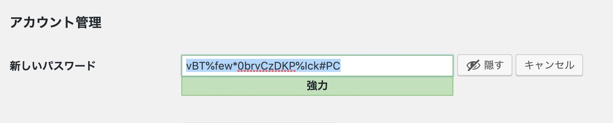
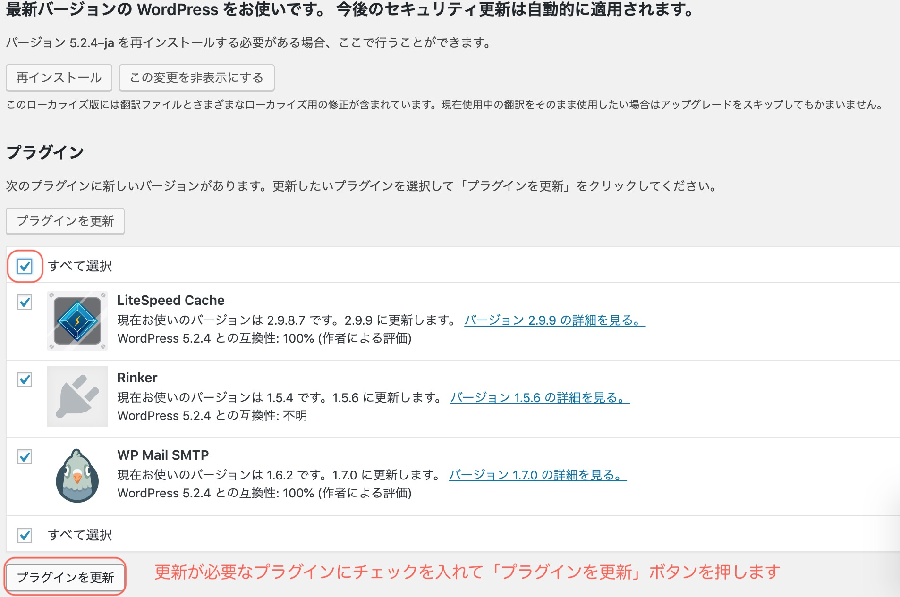
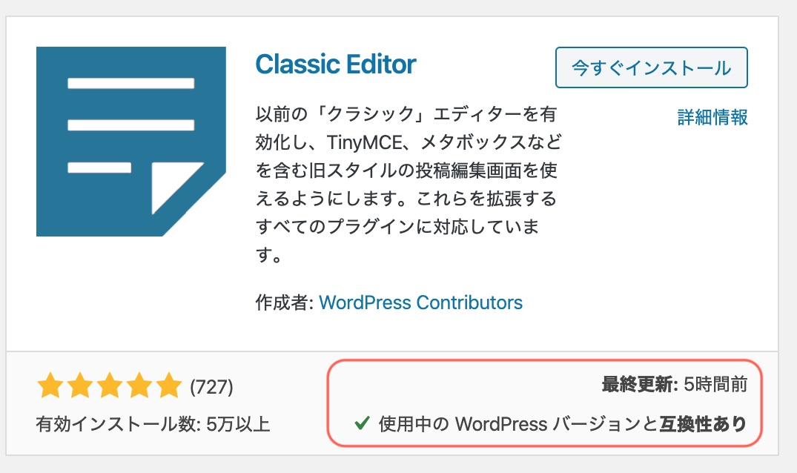
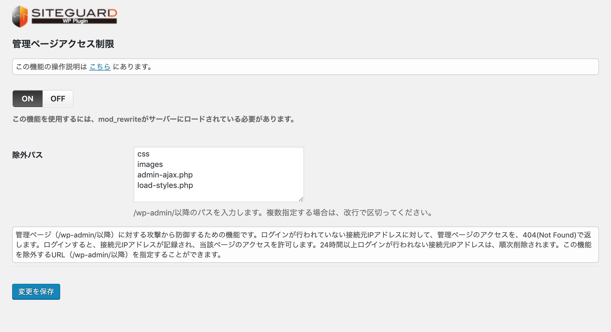
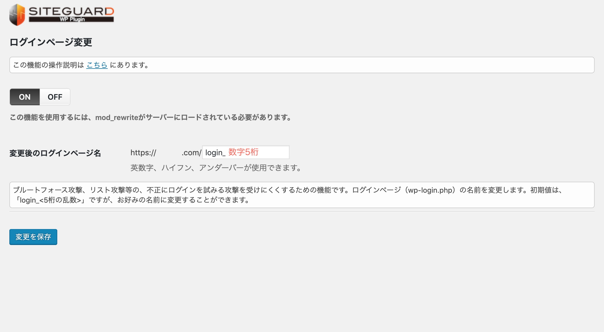
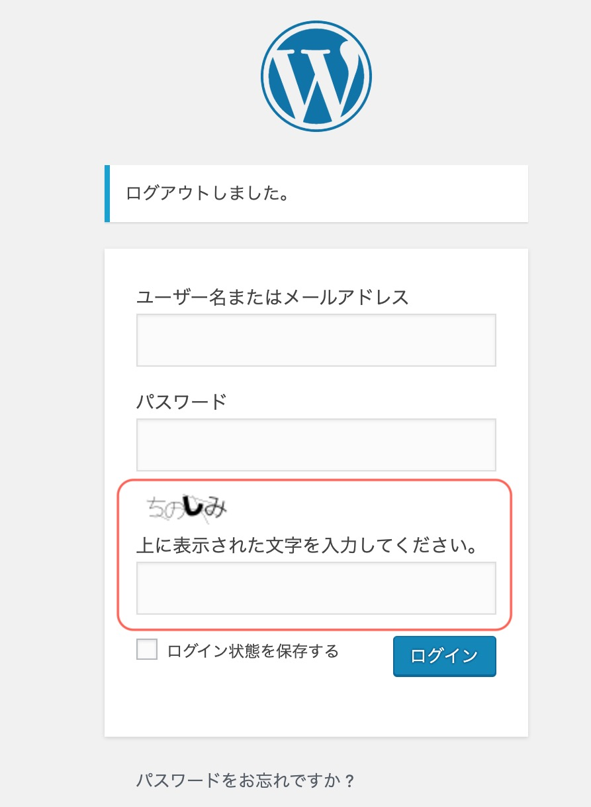
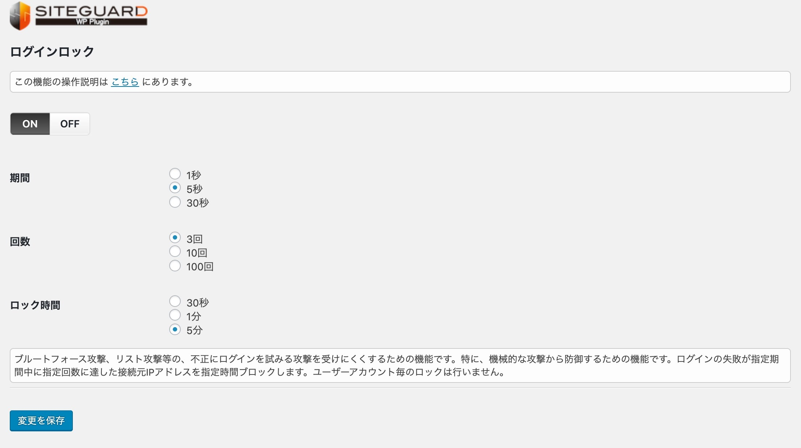
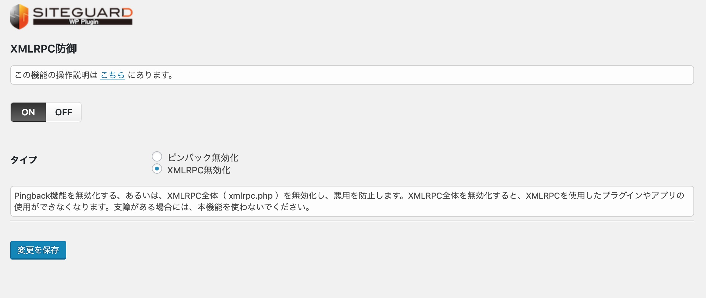

この前、WordPressブログのハッキング被害に合いました😢

カスタマイズを加えようかと、FTPソフトを開いてみると、ファイルリストの中に見知らぬフォルダがあったんです。
フォルダを消しても、またしばらくすると同じファイルができてしまう…。

調べてみると、WordPressのプログラムが不正に書き換えられていました。怪しいプログラムが仕込まれた箇所を特定し、最新のプログラムに差し替えました。

対応はできたものの、また脅威にさらされるのは嫌だ…。
これを機に、WordPressのセキュリティ対策をしっかり考えてみます。

## WordPressは攻撃対象になりやすい

WordPressは世界中で利用者の多いブログシステム。
利用者が多い分だけ、狙われやすいツールでもあります。

どんな風に狙われるかというと

* 管理画面への不正ログインによるサイト改ざんや乗っ取り
* 重要な情報の盗み取り
* 悪意のある不正なスクリプトをプログラムに埋め込む
* 過剰なデータを送信し、サイトにアクセスできないようにする
ハッキングに合うと、ホームページが見れなくなったり、不正なページへ誘導されてしまいます。

せっかく作ったwordpressブログをハッキングの脅威から守りましょう。

## 対策①ユーザーIDとパスワードを強化する

ユーザー名は
admin
administrator
ドメイン名(このサイトだったら、0forest)
などは、推測されやすいので避けましょう。

パスワードも推測されにくいもの。
pass
password
は避けましょう。

## 対策②WordPressのソフトウェア、プラグインをアップデートする

最新のWordpressソフト、プラグインを使うようにしましょう。

 プ

ラグインをインストールす時には、最近更新されたものか、最新のverに対応しているプラグインを使用するようにしましょう。

## 対策③セキュリティプラグインを入れる

私が導入しているのは３つです。

### Wordfence Security

[Wordfence Security]https://ja.wordpress.org/plugins/wordfence/

* WordPressソフトをスキャンし、不正にプログラムが書き換えられていないか チェックする
* スパムコメントのブロック
* リアルタイム・トラフィック解析:アクセスしてきた人間やBOTを監視できる
* IPブロック機能:指定したIPアドレスと接続元ネットワークからの接続を拒否する

インストールすると、メールアドレスを登録します。

基本的にそのままの設定でOK。
英語ですが、ダッシュボードにブロックした接続元や、サイトの脆弱性などが表示されます。

### SiteGuard WP Plugin

WordPressの管理画面を守るプラグインです。

[SiteGuard WP Plugin]https://ja.wordpress.org/plugins/siteguard/

* 管理画面のURLを変更
* ログインに画像認証を追加
* ログイン失敗を繰り返す接続元を一定期間ロック
* ログインしていない接続元IPアドレスから管理画面へアクセスできないようにする
* 攻撃者から狙われやすい機能(XMLRPC)を防御
 「ログインページ変更」を選ぶと管理画面のURLが変えられます。

 wordpress で作られたサイトは
https://サイトのURL/wp-admin/
が管理画面になっています。

なので、wordpress のことを使ったことがある人には、簡単に管理画面へのログインURLがわかってしまいます。
ログインページ変更を使うことで、管理画面へアクセスしにくくなります。

画像認証を追加すると、ログイン画面に画像に表示された文字を入力できるようになります。

 ログインロックは、何度も連続してログインに失敗するときに、一定期間ログインできないようにする機能です。
いろいろなユーザーアカウントやパスワードを機械的に入れてログインしようとする攻撃に有効です。

 XMLRPCはWordPressを外部から操作するための仕組みです。
メール投稿などの機能を利用していない場合は無効にしましょう。

### Akismet

スパムコメントのブロックをしてくれます。
ユーザー登録が必要ですが、無料で利用できます。

お問い合わせフォームやコメント機能を利用している方は導入しておきましょう。

## 対策④バックアップを取る

仮に攻撃者によってホームページが改ざんされたり、削除された場合に備えて、プラグイン でバックアップを取っております。

BackWPupというプラグインを使うと、月次でデータベースとファイルのバックアップができます。

また、サーバーでも、データのバックアップな復旧サービスを提供していることもあります。お使いのサーバーの機能を確認してみてくださいね。

## より専門的な対策

FTPソフトを使えて、サイトのディレクトリにアクセスできる方は以下のような対策もできます。

* [【Basic認証】WordPressサイトにパスワードをつける](/basic-password/)
