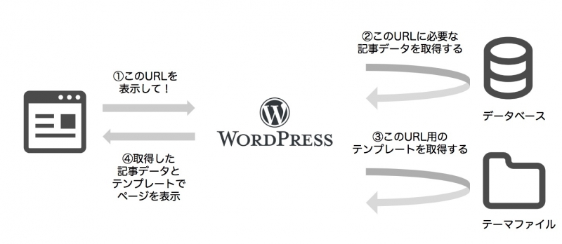
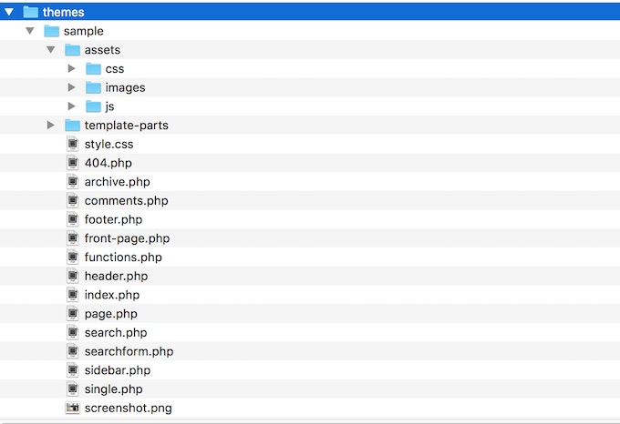
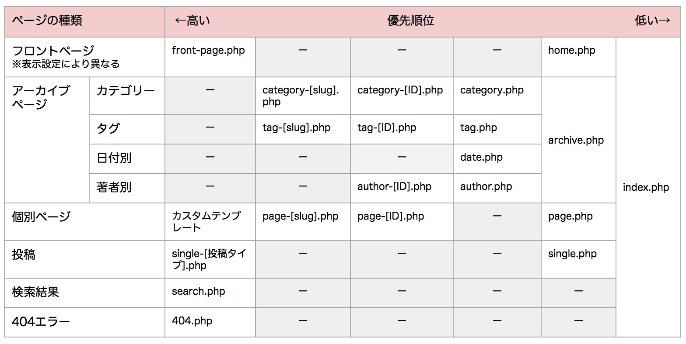
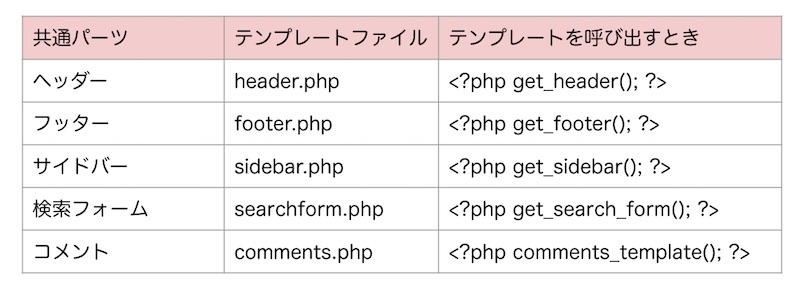

* テーマを作りたいんだけど、どのテンプレートを作ればいいの？
* ページを表示するとき、テーマ内ファイルはどう使われるの？

WordPressのテンプレートファイルが選ばれる仕組みを書いていきます。

## ページによってどのテンプレートファイルを使うか決まっている



ページの種類によって、WordPress側テーマ内でどのファイルを使うかを自動で選んでくれます。

[WordPressが記事を表示する仕組み〜メインクエリとサブクエリ〜](/wordpress-query/)

## テーマのファイル構成

テーマはテンプレートファイル（PHPファイル）で構成されています。



＜assetsフォルダ内＞

css、画像、javascriptなど、装飾に必要なファイルが入っています。

＜コンテンツを表示するための主なテンプレート群＞

* index.php、front-page.php ：トップページ用のテンプレート
* page.php：固定ページ用のテンプレートファイル
* single.php：記事投稿用のテンプレートファイル
* archive.php：記事一覧用のテンプレートファイル
* 404.php：ページが見つからない時に表示するテンプレートファイル
* search.php、seachform.php：サイト内検索用のテンプレートファイル
* header.php、footer.php、sidebar.php、comments.php：ヘッダー、フッター、サイドバー、コメントなど、共通して使うパーツを切り出したファイル
* functions.php：テーマ内で使う機能を記述したファイル
* screenshot.png：テーマのイメージ画像

最低限必要なのはこの２つ
* index.php（ページの表示を記述するテンプレートファイル）
* style.css（ページの装飾を記述するCSSファイル）

## テンプレートファイルの優先順位

ページの種類によって、どのテンプレートファイルを使うかは優先順位が決まっています。この順番はファイル名で判断されています。



テーマを作るときは、コンテンツに沿って、上記に応じたファイル名をつけてあげてください。

### 表示中のページに、どのテンプレートファイルを使われているかを確認する

```php:title=footer.php
<?php
    global $template;
    $template_name = basename($template, '.php');
    echo $template_name;
?>
```
## 共通パーツはモジュールテンプレートに書く

WordPressのテンプレートは１ファイルに１ページというわけではなく パーツごとにファイルに切り出すことができます。

よく使う共通パーツを表にしました。


### 基本のモジュール

```php:title=index.php
<?php get_header();?>
    <main role="main">
        <div class="container">
            <?php get_template_part('loop'); ?>
            <?php get_sidebar(); // sidebar.phpを読み込む?>
        </div>
    </main>
<?php get_footer(); // footer.phpを呼び出す?>
```

### カスタムモジュール

上記以外にも、必要に応じて、モジュールテンプレートを作ることができます。

```php
<?php get_template_part(‘loop’); ?>
```
とかくと、loop.phpを呼び出すことができます。

```php:title=loop.php
<?php if(have_posts()):
    while(have_posts()): the_post(); ?>
        <article id="post-<?php the_ID(); ?>" <?php post_class();?>>
            <?php the_category(', '); ?>
            <a href="<?php the_permalink(); ?>"><?php the_title(); ?></a>
            <?php the_excerpt(); ?>
        </article>
    else : ?>
        <p>投稿が見つかりません。</p>
<?php endif; ?>
```

## まとめ
* アクセスしたURLに応じて、WordPress側がどのテンプレートを使うかを自動で選んでくれる
* ページ種類によって、どのテンプレートファイルを作るかが決まる。
* 共通するコードはモジュールテンプレートとして切り出すことができる。

