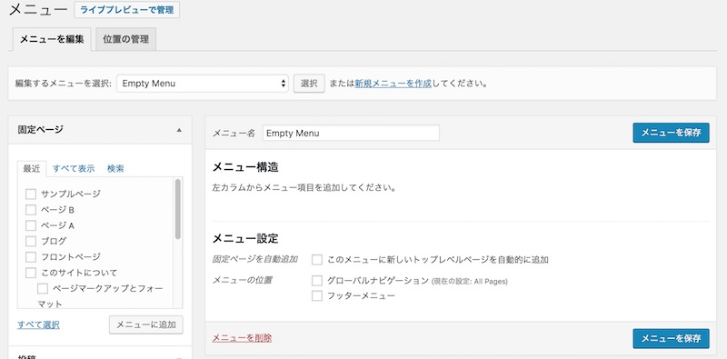

## functions.phpでできること

functions.phpには、テーマの中で使う機能やテーマの設定します。

ここに機能をまとめて書いておくことで、同じ処理をつかいまわしたり、ページテンプレートの方のコードをシンプルにできます。
functions.phpはとても大事なファイルで、適切にコードが書けていないと、サイトが真っ白になったり、テーマが動作しないので注意してくださいね。

## CSSとjavascriptを読み込む

まず、 `</head>`の前にwp\_head()を書く

```php
 <?php wp_head(); ?>
</head>
```

wp\_head()を入れることで、メタ情報をWordPressが自動で出力してくれます。

【余談：wp\_headの不要タグ削除】

wp\_head()では余計なコードも勝手に吐き出されてします。

remove\_actionを使って、コードが表示されないように設定できます。

```php:title=functions.php
remove_action('wp_head', 'wp_generator'); //WordPressのバージョン情報を非表示
remove_action('wp_head', 'feed_links_extra', 3);// RSSフィードを非表示
remove_action('wp_head', 'rsd_link'); // 外部ツールを用いた記事投稿を非表示
remove_action('wp_head', 'wlwmanifest_link'); // Windows Live Writer記事投稿を非表示
remove_action('wp_head', 'wp_shortlink_wp_head');// デフォルトパーマリンクを非表示
remove_action('wp_head', 'adjacent_posts_rel_link_wp_head');//前記事と後記事を非表示
remove_action('wp_head', 'print_emoji_detection_script', 7); // 絵文字を非表示
remove_action('admin_print_scripts', 'print_emoji_detection_script'); // 絵文字を非表示
remove_action('wp_print_styles', 'print_emoji_styles' ); // 絵文字を非表示
remove_action('admin_print_styles', 'print_emoji_styles'); // 絵文字を非表示
remove_action('wp_head','rest_output_link_wp_head');
remove_action('wp_head','wp_resource_hints',2); // dns-prefetchを非表示
```

## テーマ内で使うCSSとJavascriptファイルを指定する

[WordPressテーマにCSSとJavascriptを読み込む](/wordpress-theme-css-js/)に詳しく記載しています。

## カスタムヘッダー
カスタムヘッダー画像を利用することで、管理画面からタイトル画像を変更できるようになります。


functions.phpでカスタムヘッダーを有効にする

```php:title=functions.php
<?php
$custom_header_defaults = array(
    'default-image' => get_bloginfo('template_url').'/img/wp-titlelogo.jpg',
    'width' => 1000, // ヘッダー画像の横幅
    'height' => 200, // ヘッダー画像の縦幅
    'header-text' => false, //ヘッダー画像上にテキスト表示するかどうか
);
add_theme_support( 'custom-header', $custom_header_defaults );
```

### テンプレートファイル側でヘッダー画像を表示する

```php:title=functions.php
<?php if ( get_header_image() ) : ?>
    " height="<?php echo get_custom_header()->height; ?>" width="<?php echo get_custom_header()->width; ?>" alt="">
<?php endif; ?>
```


## ナビゲーションメニュー

```php:title=functions.php
functions.phpで使うメニューを登録する
register_nav_menus(
    array(
        'global' => 'グローバルナビゲーション', // メニュー名
        'footer_menu' => 'フッターメニュー', // メニュー名
    ));
```

ここで指定されたメニュー名が、メニューの位置として指定できます。

管理画面から「外観」＞「メニュー」でメニューを設定することができます。



続いて、テンプレートファイルにメニューを表示するコードを書きます。

メニューを表示させる場所(テンプレートファイル)に以下のコードを書きます。
だいたいheader.phpに書かれることが多いです。

```php
<?php if(has_nav_menu('global')): ?> // メニューがあるときに表示
    <?php wp_nav_menu( array(
        'theme_location' => 'global', // register_nav_menuで設定したメニュー名
        'container' =>'nav', // ①ナビゲーションを囲むタグ
        'container_id' =>'global-menu', // ②ナビゲーションを囲むタグに入るid
        'container_class' =>'menu-container', // ③ナビゲーションを囲むタグに入るclass
        'menu_id' => 'menu-id', // ④ulタグに入るid
        'menu_class' => 'nav-menu', // ⑤ulタグに入るclass
    ));
?>
<?php endif; ?>
```

上のコードで指定した①〜⑤に基づいて、このようにHTMLが出力されます。


```markup
<① id="②" class="③">
    <ul id="④" class="⑤">
        <li id="menu-item-XX">
            <a href="">TOP</a>
        </li>
    </ul>
</①>
```

## ウィジットエリア
ウィジットエリアをテーマに追加することで、投稿一覧や検索、カテゴリー一覧など、便利な部品を表示することができるようになります。


## サムネイルを有効にする

```php:title=functions.php
add_theme_support('post-thumbnails');
add_image_size( 'thumbnail', 280, 280, true );
```

add_image_size(新しい画像サイズの名前,横幅(px),高さ(px),画像の切り抜き)です。

画像を表示させるところ（テンプレートファイル）には、このように記載します。
```php
<?php if (has_post_thumbnail()) : ?>
    <?php the_post_thumbnail('thumbnail'); ?>
<?php else : ?>
    
<?php endif ; ?>
```


## 抜粋の文字数、文末の表示を変える

```php:title=functions.php
// 抜粋する文字数を120文字に設定する
function my_excerpt_length($length) {
    return 120;
}
add_filter('excerpt_length', 'my_excerpt_length');

//概要（抜粋）の文末の文字[…]を削除する
function my_excerpt_more($more) {
    return '';
}
add_filter('excerpt_more', 'my_excerpt_more');
```

## ビジュアルエディタのカスタマイズ
ビジュアルエディタ（記事投稿画面）をカスタマイズすることで、ブログの記事を書く時の手間がなくなって楽に♪

* [WordPressのビジュアルエディタによく使うボタンを設定する。](/visual-editor-css/)
* [ビジュアルエディタの見た目を実際の記事に揃える](/visual-editor-button-customize/)

画像を表示させるところには、このように記載します。