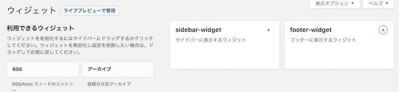

ウィジットは**WordPressにあらかじめ用意されている部品**のことです。

サイドバーやフッターなど、好きな場所にウィジットエリアを作ると、これらのウィジットを表示できるようになります。

## ウィジットエリアとは

ウィジットエリアはウィジット（部品）を入れるための、場所です。

「メニュー」「記事一覧」「カテゴリー」「テキストエリア」「検索バー」など、よく使う項目がウィジット（＝部品）として用意されています。

管理画面から、ウィジットを選んで、ウィジットエリアに配置することで、ホームページに表示されるようになります。

## functions.phpにウィジットエリアを登録する

```php:title=functions.php
register_sidebar( array(
    'name' => 'sidebar',
    'id' => 'sidebar-widget',
    'description' => 'サイドバーに表示するウィジット',
    'before_widget' => '<section id="%1$s" class="widget %2$s">',
    'after_widget' => '</section>',
    'before_title' => '<h2 class="widget-title">',
    'after_title' => '</h2>',
));
register_sidebar( array(
    'name' => 'footer-widget',
    'id' => 'footer-widget',
    'description' => 'フッターに表示するウィジット',
    'before_widget' => '<section id="%1$s" class="widget %2$s">',
    'after_widget' => '</section>',
    'before_title' => '<h2 class="widget-title">',
    'after_title' => '</h2>',
));
```

functions.phpに書くと、管理画面でウィジットを設定できるようになります。

コードの説明
* name  :管理画面で表示される名前
* id    :ウィジットID（半角英数字
* description :管理画面に表示する名前
* class :ウィジットにつけるクラス
* before\_widget :ウィジット前につく文字列
* after\_widget :ウィジット後につく文字列
* before\_title :ウィジットタイトルの前につく文字列
* after\_title :ウィジットタイトルの後につく文字列

管理画面でウィジットを設定できるようになりますので、ウィジットを好きなエリアに追加して保存してください。



### ウィジットエリアを表示する

ウィジットを表示させたい場所（テンプレートファイル）に以下のような記述をします

```php
<?php if (is_active_sidebar('sidebar-widget')) { ?>
    <div class="widget-area">
        <?php dynamic_sidebar('sidebar-widget'); ?>
    </div>
<?php } ?>
```

## 【応用編】条件によって、表示するウィジットを切り替える

 WordPressには条件分岐タグが用意されています。 これらを使って、ページによってウィジットを表示/非表示を分けることができます。

 * is\_front\_page() : ホームページかどうか
 * is\_single()：投稿ページかどうか
 * is\_single()：固定ページかどうか
 * wp\_is\_mobile()：モバイルデバイスかどうか

例：トップページにのみ、ウィジットエリアを表示させたい時は、is\_fornt\_pageをif条件に追加します。

```php
<?php if (is_front_page() && is_active_sidebar('sidebar-widget')) { ?>
    <div class="widget-area">
        <?php dynamic_sidebar('sidebar-widget'); ?>
    </div>
<?php } ?>class="widget-area"> <?php dynamic\_sidebar('sidebar-widget'); ?> </div> <?php } ?>
```


例：スマホの時は表示しない場合は!wp_is_mobile()をif条件に追記します。

```php
<?php if (!wp_is_mobile() && is_active_sidebar('sidebar-widget')) { ?>
    <div class="widget-area">
        <?php dynamic_sidebar('sidebar-widget'); ?>
    </div>
<?php } ?>
```

## まとめ

ウィジットエリアを使うと、ブログのカスタマイズの幅がどんと広がりますね。

ウィジットエリアの追加方法のおさらいです。
* テーマのfunctions.phpにウィジットエリアを追加するコードを書く
* ウィジットエリアを表示させたい場所（サイドバーやフッターなど）に表示用のコードを書く
* 管理画面から、ウィジットを設置する
