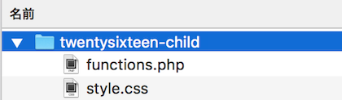
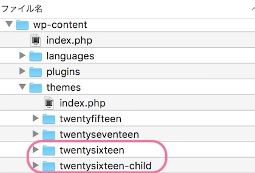

WordPressでは、たくさんのデザインがテーマとして公開されています。

テーマのデザインを一部だけカスタマイズしたいときには、子テーマを使います。

## テーマのカスタマイズに、子テーマを使う理由

子テーマは、WordPressにインストールしたテーマをベースに、一部分だけ変更するためのテーマです。

### テーマがバージョンアップされても、子テーマの変更はそのまま使える

公開中のテーマは開発者が随時バージョンアップしていきます。
WordPressユーザーがテーマの中にあるファイルを書き換えても、テーマがアップデートされると、自分が更新した部分が消えてしまいます。

子テーマを使うことで、バージョンアップされた時でも、自分が変更した箇所はそのまま残すことができます。

### 安全にカスタマイズが勧められる

テーマをカスタマイズするときには、テーマの構造を理解したり、書かれているプログラムの内容を読み解いたり、技術的な知識が必要になります。

うっかり、誤った場所を更新してしまうと、ページ全体が表示されなくなってしまうリスクがあります。

子テーマを使えば、もし間違った操作をしても、子テーマの中のファイルだけを見直せばいいので、安全にカスタマイズを進められます。

WordPressは子テーマを親テーマに上書きして、動作するようになっています。

◯ 親テーマ＝ベースとなるテーマ（開発者が随時アップデートするのでさわらない）
◯ 子テーマ＝カスタマイズするテーマ（更新したいファイルのみ追加する）

## 子テーマの作り方

Twenty Sixteenのテーマを例に、子テーマの作り方を説明します。

### ①子テーマのフォルダを作る

 自分のパソコン上でフォルダを作ってください。

フォルダ名は「**親テーマ-child**」とすると分かりやすいです。

このフォルダの中に、子テーマのファイルを作っていきます。

* style.css（必須）
* functions.php（必須）
* 変更したいファイル（任意）

最低限必要なのはstyle.cssとfunctions.phpです。
style.cssがテーマの外観を設定するためのファイル。
functions.phpはテーマに機能を追加するためのファイルです。

### ②style.cssにテーマの情報を書く

style.cssは子テーマの名前と親テーマの名前を書きます。

```css:title=style.css
/*
Theme Name: Twenty Sixteen Child
Template: twentysixteen
*/
/* 以下、子テーマ用のスタイルを記述します。*/
body{
    background:#FFEEB4;/* 試しに背景を黄色にしてみるよ */
}
```

Theme Name:子テーマの名前
Template:親テーマのフォルダ名

Templateは親テーマの名前とは違うので注意してください。

### ③functions.phpの中身を書く

functions.phpは、テーマが動作するための機能を記述したファイルです。
ここで、CSSファイルの読み込み順序を記載します。

親テーマのCSSを読み込んだあと、子テーマのCSSが上書いて反映されます。

```php:title=functions.php
<?php
add_action( 'wp_enqueue_scripts', 'theme_enqueue_styles' );
function theme_enqueue_styles() {
    wp_enqueue_style( 'parent-style', get_template_directory_uri() . '/style.css' );
    wp_enqueue_style( 'child-style', get_stylesheet_directory_uri() . '/style.css', array('parent-style')
);
}
//以下に子テーマ用の関数を書く
```

この他に、親テーマを上書きたいファイルがあれば、作成します。
親テーマのファイルを複製して、子テーマのフォルダ内に置きます。
そして、そのファイルのソースを編集していきます。

### ⑤子テーマをアップロード＆インストール

FTPツールでアップロードする場合は
wordpressをインストールしたフォルダ＞wp-content＞themesの中に子テーマのフォルダを配置します。
※themesの中には、親テーマも忘れず入れておいてくださいね。

 管理画面からアップロードする場合は、子テーマのフォルダを圧縮してZIPファルにします。


外観＞テーマ＞新規追加＞テーマのアップロードでZIPファイルをアップロードできます。

最後に、子テーマを有効化します。

以上で、子テーマのカスタマイズが反映されます。