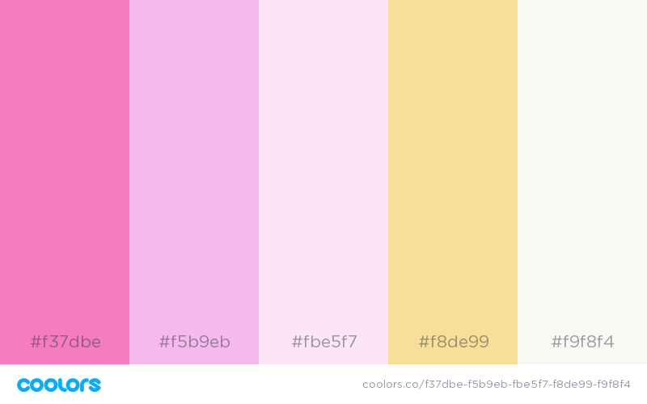
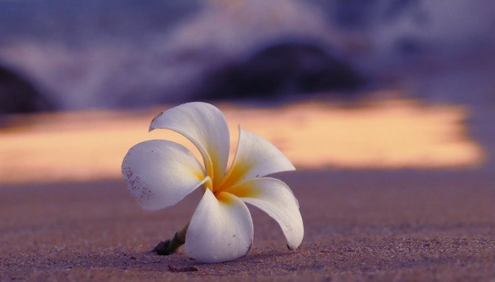

極上のロミロミを体験できるサロン、ハワイアンヒーリングサロンをPualei様のサイト制作に携わらせていただきました。

<a href="https://hawaiian-pualei.com/" target="_blank" rel="noopener noreferrer">ハワイアンヒーリングサロン Pualei</a>

## 私がお手伝いしたこと

予算内でおしゃれなサイトを運営できるよう、ご要望をお伺いしながら、WordPressの導入、テーマのカスタマイズ、レクチャーを行いました。

テーマはデザイン面で優れ、なおかつ、コンテンツの発信に必要な機能がそろったテーマをいくつか選ばせていただきました。
お問い合わせフォームや、トップページのレイアウトなど、テーマをそのまま使えない部分はカスタマイズしています。

メインカラーはマゼンダピンク♪そして、アイコンはプアレイの花。
ハワイの空気を感じてもらえるようなページになったでしょうか＾＾
マゼンダは、愛の色なので、ロミロミの世界観にもぴったり。

「ここのピンクはもうちょっと濃いめ？」
「このピンクには、薄めの黄色を合わせると良さそう？」

打ち合わせの中で、レイアウトや色を実際に設定して、見た目を確認しながら、調整していきました。

### 操作レクチャーとQAで使い方をマスター

写真や文章などのコンテンツは全て、ご本人が作成&更新しています。
目指すのは、作った後も自分の手で育てていけること！

実際に操作していると、いろいろ疑問だったり、やってみたいことがでてくるもの。
「なぜか不自然な改行が空いてしまう…」
「アイキャッチってどうやって作る？」
「ここに動画を載せるにはどうしたらいい？」
「Line＠のお友達登録ボタンを追加したい」などなど、
毎回のミーティングに疑問点を持ってきていただいて、解消させていただきました。

とても熱心に聞いてくださったので、私も伝えがいがありました＾＾

### 運営中のサイトから新しいサイトへ切り替え

* 運営中のホームページリニューアル
* 元のコンテンツのデータを引き継ぎたい
* サーバー／ドメイン管理会社を変更する

運営中のホームページがある場合は、別のURLを用意して、ホームページを作る必要があります。
元のコンテンツを新しいホームページに移して、フォーマットやレイアウトの調整をしています。
そして、ホームページが完成した段階で、本番公開していきます。
この辺は、サーバーやドメインの知識が必要なのでプロに任せてしまった方が簡単ですね。

せっかく公開したのに、アクセスできない、メールが届かない、お問い合わせフォームが動かないなどの不備があってはなりません。
いつも以上に、一つ一つの作業や動作確認に神経を使いました。

おかげで今回は特にトラブルもなく、ホームページをスムーズに刷新できました！

## いただいたご感想

  
    いただいたご感想
  
最初はパソコン音痴の私にできるか不安でしたが、とても丁寧な指導でわかりやすかったです。

仕事と家事で毎日忙しかったので、ZOOMで受講できたのはとても助かりました。

HPを作っていくと、ここをもっとこんな感じしたいっていう要望がたくさん出てきたのですが、それに対してもしっかりやり方を教えていただけました。

細かい要望や、前に聞いて忘れてしまった事も、優しく教えてくださいます。

素人目線でこうしたら変かなぁ？と迷ったりする部分も、いろいろアドバイスもいただけました。

私の好みを把握してくださり、いろいろ提案もしていただき、助かりました。

プロじゃないと難しい作業については、要望に合わせてカスタマイズしていただきました。
そして、私好みの素敵なHPができあがり、とっても嬉しいです！
新しいHPは周りからの評判がとても良いです。

ありがとうございました＾＾

## ハワイアンヒーリングサロンPualeiはこんな方にオススメです

ヒーリングサロンのPualeiの持ち味である、確かな腕と、慈しむような愛、自然のしなやかさを表現しています。

ブログ記事や各ページも読み応え抜群。

Pualeiはこんな方にオススメのサロンです。

* 癒されたい方
* 頑張り屋さんで疲労を感じている方
* 体だけでなく心からリラックスしたい方
* 本物のロミロミを体験したい方
ご興味のある方はぜひ、ハワイアンヒーリングサロンのハッピーな世界にふれてみてくださいね。

[ハワイアンヒーリングサロン Pualeiのホームページはこちら](https://hawaiian-pualei.com/)