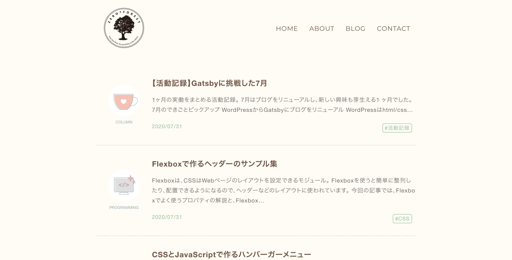
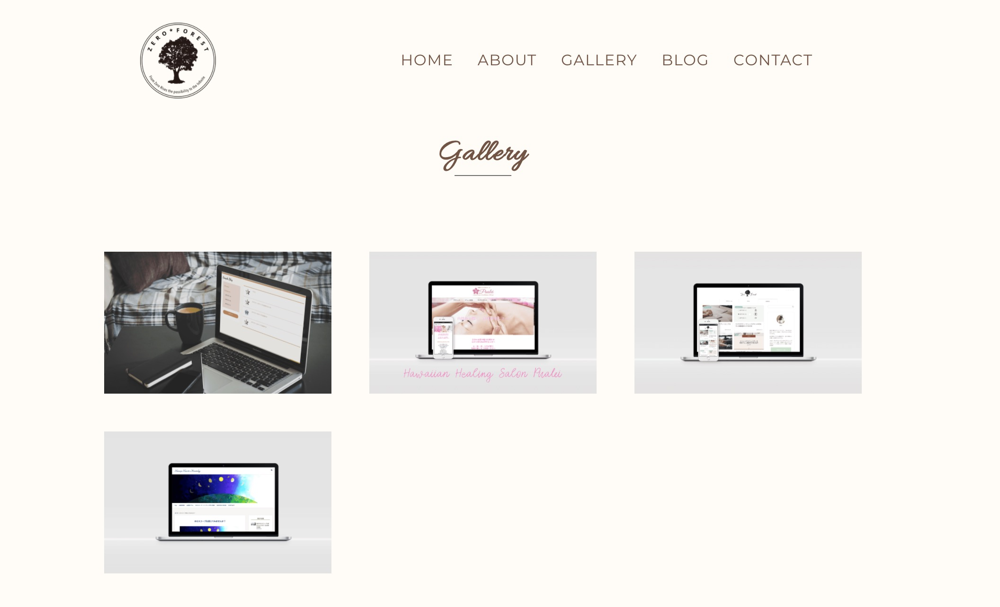
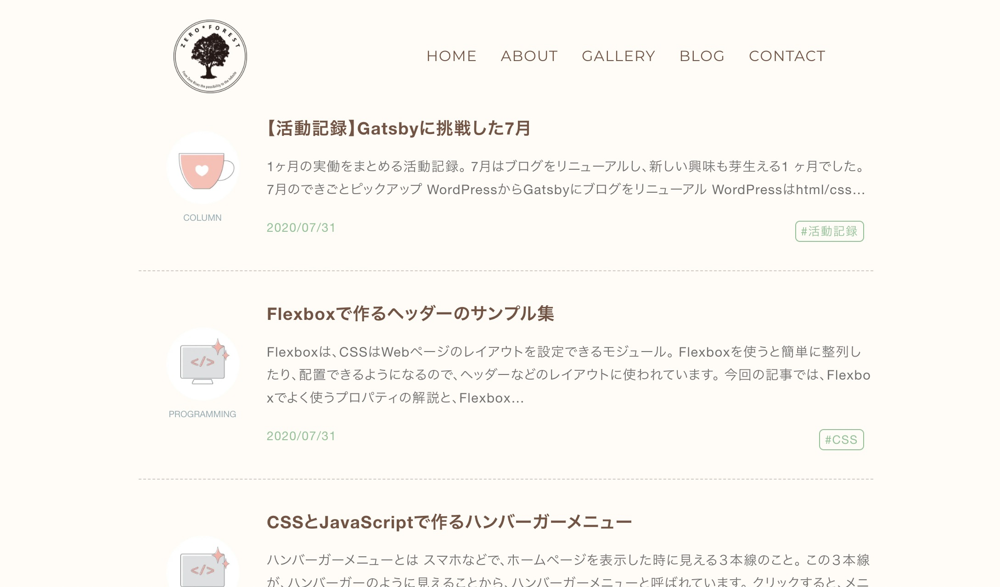

WordPressブログをGatsbyに変えました。

WordPressは3年ほどを使っていて、細かくカスタマイズしながら、魅せるブログを作れるところがお気に入りでした。

ただ、管理画面での動作が重いこと、 レイアウトを整える方に時間がかかってしまうことが悩み。
また、アイキャッチ画像がなくても、綺麗に見えるブログにして、楽に記事を更新したいと思っていたのです。
そこでGatsby.jsを知りました。

## Gatsbyブログにした目的

Gatsbyでブログを作ることでこんなメリットがあります。

①管理画面にログインせずに記事投稿できる

アイキャッチ画像のアップロードもしなくてOK。
記事をフォルダ管理できます。

②Gitで記事を管理したい
Gitで記事の変更履歴を残して、記事のどの文章を修正したか追えるようになります。

③Gitでプログラムを管理したい
プログラムの変更を登録したら、FTPでファイルをアップロードしなくても、反映される。

## 制作過程

GatsbyもReactもはじめて。

①シンプルに記事一覧を表示させるところからはじめました。

②ブログ記事とは別に制作物記事も管理できるようにしました。

③ハンバーガーメニューを追加

これからも、育てていきたいと思います。
